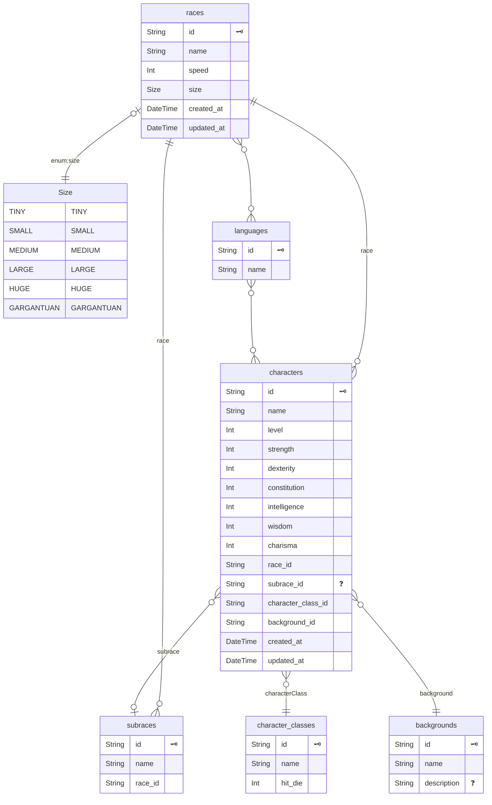

```mermaid
erDiagram

        Size {
            TINY TINY
SMALL SMALL
MEDIUM MEDIUM
LARGE LARGE
HUGE HUGE
GARGANTUAN GARGANTUAN
        }
    
  "races" {
    String id "🗝️"
    String name 
    Int speed 
    Size size 
    DateTime created_at 
    DateTime updated_at 
    }
  

  "subraces" {
    String id "🗝️"
    String name 
    String race_id 
    }
  

  "character_classes" {
    String id "🗝️"
    String name 
    Int hit_die 
    }
  

  "backgrounds" {
    String id "🗝️"
    String name 
    String description "❓"
    }
  

  "languages" {
    String id "🗝️"
    String name 
    }
  

  "characters" {
    String id "🗝️"
    String name 
    Int level 
    Int strength 
    Int dexterity 
    Int constitution 
    Int intelligence 
    Int wisdom 
    Int charisma 
    String race_id 
    String subrace_id "❓"
    String character_class_id 
    String background_id 
    DateTime created_at 
    DateTime updated_at 
    }
  
    "races" |o--|| "Size" : "enum:size"
    "races" o{--}o "languages" : ""
    "subraces" }o--|| races : "race"
    "languages" o{--}o "characters" : ""
    "characters" }o--|| races : "race"
    "characters" }o--|o subraces : "subrace"
    "characters" }o--|| character_classes : "characterClass"
    "characters" }o--|| backgrounds : "background"
```
