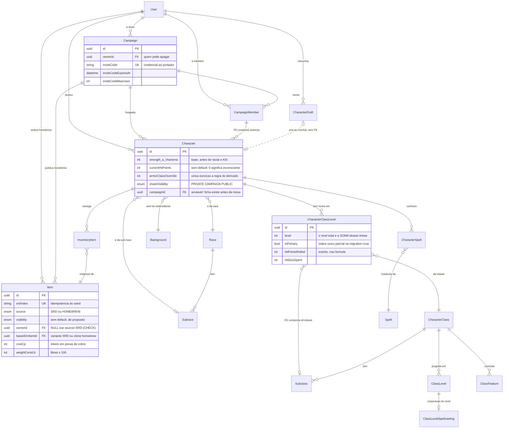
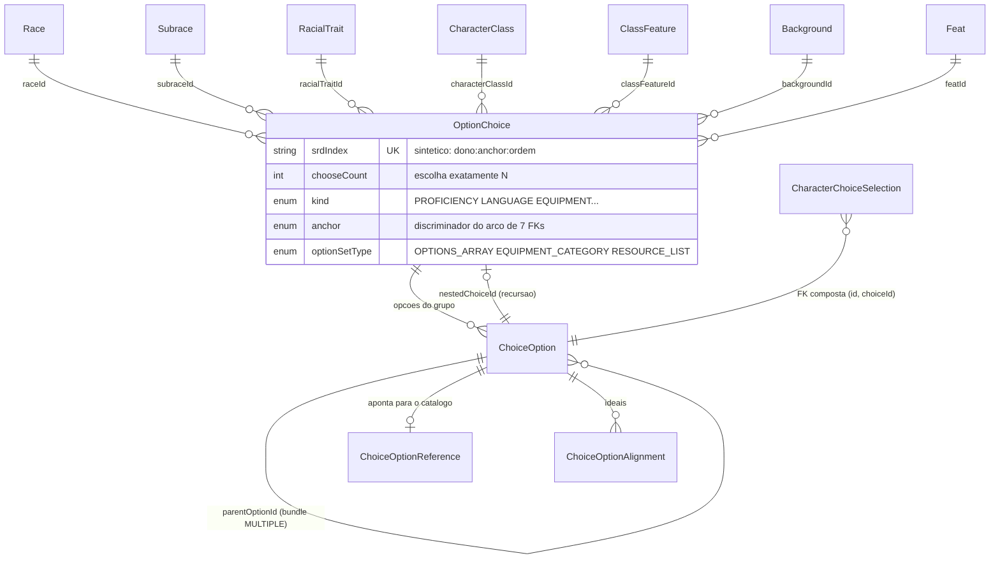
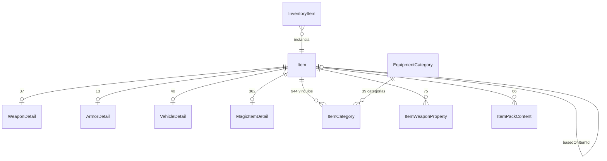

# Modelagem do SRD 5.1 — fichart-api

> Como os 25 arquivos JSON do SRD 5.1 viraram um esquema relacional, e por quê.
>
> **Fonte da verdade:** [`prisma/schema.prisma`](../prisma/schema.prisma). Este documento
> **explica** o schema; ele não o substitui. Quando os dois divergirem, o schema está certo
> e este arquivo está desatualizado.
>
> **Última atualização:** 25/08/2026 — fim da Etapa 5.6 (modelagem completa do SRD).
> **Dados de origem:** `5e-bits/5e-database`, commit `ce47a18dfeb3e41a1b2a2dfe00a25761c3c3a4f1`,
> ruleset 2014 (SRD 5.1). Licenciamento e atribuição em [`NOTICE.md`](../NOTICE.md).

---

## Sumário

1. [Panorama](#1-panorama)
2. [Diagrama](#2-diagrama)
3. [As decisões difíceis](#3-as-decisões-difíceis)
4. [A simplificação: 118 → 81](#4-a-simplificação-118--81)
5. [Matriz de autorização](#5-matriz-de-autorização)
6. [O que é derivado e não está no banco](#6-o-que-é-derivado-e-não-está-no-banco)
7. [Plano de importação](#7-plano-de-importação)
8. [Achados da revisão que foram descartados](#8-achados-da-revisão-que-foram-descartados)
9. [O que ficou fora de escopo](#9-o-que-ficou-fora-de-escopo)

---

## 1. Panorama

**81 modelos, 40 enums, 4.724 linhas** de `schema.prisma`.

| Bloco | Modelos | O que guarda |
|---|---:|---|
| **Catálogo SRD** | **59** | Tudo que o SRD publica: regras, magias, equipamento, classes, raças, antecedentes, talentos — mais o motor de escolhas e a tabela de traduções |
| **Personagem** | **17** | A ficha, o rascunho do wizard e todo o estado mutável de sessão |
| **Campanha** | **2** | A mesa e quem está nela |
| **Conta** | **3** | Usuário, credencial e pagamento |

### 1.1. Catálogo SRD (59 modelos)

| Sub-bloco | Modelos |
|---|---|
| Vocabulário base (8) | `AbilityScore` `Skill` `DamageType` `MagicSchool` `Condition` `Alignment` `Language` `WeaponProperty` |
| Motor de escolhas (4) | `OptionChoice` `ChoiceOption` `ChoiceOptionReference` `ChoiceOptionAlignment` |
| Equipamento (10) | `EquipmentCategory` `Item` `WeaponDetail` `ArmorDetail` `VehicleDetail` `MagicItemDetail` `ItemCategory` `ItemWeaponProperty` `ItemPackContent` `Proficiency` |
| Magias (4) | `Spell` `SpellScaling` `SpellClass` `SpellSubclass` |
| Classes (17) | `CharacterClass` `ClassSavingThrow` `ClassProficiencyGrant` `ClassStartingEquipmentItem` `MulticlassPrerequisite` `ClassSpellcasting` `Subclass` `SubclassSpell` `SubclassSpellPrerequisite` `ClassLevel` `ClassLevelSpellcasting` `ClassLevelSpellSlot` `SubclassLevel` `ClassResourceDefinition` `ClassFeature` `ClassFeatureArmorFormula` `FeaturePrerequisite` |
| Raças (9) | `Race` `Subrace` `RacialTrait` `RaceTraitGrant` `RaceLanguage` `AbilityBonusGrant` `RacialTraitProficiency` `BreathWeaponDetail` `BreathWeaponDamageByLevel` |
| Antecedentes e talentos (6) | `Background` `BackgroundFeature` `BackgroundProficiency` `BackgroundStartingEquipmentItem` `Feat` `FeatPrerequisite` |
| i18n (1) | `Translation` — transversal, atende os 21 tipos de entidade traduzíveis |

### 1.2. Personagem (17 modelos)

| Sub-bloco | Modelos |
|---|---|
| Ficha (1) | `Character` |
| Composição (5) | `CharacterClassLevel` `CharacterProficiency` `CharacterLanguage` `CharacterSpell` `CharacterFeature` |
| Estado de sessão (5) | `InventoryItem` `CharacterCondition` `CharacterSpellSlot` `CharacterResourceUsage` `CharacterActiveEffect` |
| Progressão (2) | `CharacterAbilityImprovement` `CharacterHitPointModifier` |
| Escolhas (1) | `CharacterChoiceSelection` |
| Wizard (3) | `CharacterDraft` `CharacterDraftClassLevel` `CharacterDraftSelection` |

### 1.3. Campanha (2) e conta (3)

`Campaign` `CampaignMember` — `User` `UserCredential` `Payment`.

### 1.4. Convenções que valem para os 81

1. Identificadores e comentários em **inglês**; modelo singular `PascalCase`, tabela plural `snake_case`.
2. `String @id @default(uuid(7))` em todos.
3. Nada de palavra reservada — nem da linguagem (`CharacterClass`, nunca `Class`) **nem do Postgres**. O campo Prisma `desc` mantém o nome (casa com a chave do JSON), mas a coluna é `description` via `@map`: `desc` é totalmente reservado no Postgres e `SELECT name, desc FROM spells;` no `psql` é erro de sintaxe.
4. `source` é uma palavra reservada **do projeto**, para uma pergunta só: SRD ou HOMEBREW. A origem de uma concessão (raça, classe, talento) chama-se `origin`.
5. Soft delete é `deletedAt DateTime?`, nunca booleano.
6. **Estado derivado nunca é coluna** — duas exceções documentadas: `Character.armorClassOverride` e `User.premiumUntil`.
7. Toda FK usada em filtro ou join tem `@@index` explícito.
8. Dinheiro e medida são inteiros na menor unidade: `costCp`, `weightCentiLb`, `Payment.amountMinorUnits`.
9. Conjunto fechado é enum; conjunto aberto (`locale`) é string.
10. Documentação com `///`.
11. Toda tabela de catálogo tem `srdIndex String? @unique` e `source ContentSource`.

---

## 2. Diagrama

Recorte da espinha dorsal — **16 das 81 entidades**. Um DER com as 81 é ilegível e por isso
não existe aqui; os recortes do motor de escolhas e do polimorfismo de item estão nas
seções [3.3](#33-o-motor-de-escolhas) e [3.4](#34-o-polimorfismo-de-item).
O DER completo, gerado automaticamente pelo `prisma-erd-generator`, fica em
[`docs/ERD.md`](./ERD.md).



---

## 3. As decisões difíceis

Cada uma no mesmo formato: **o problema**, **as alternativas**, **a escolha e o porquê**,
e — quando existe — **o que se perdeu**.

### 3.1. Espaços de magia

**O problema.** `Levels.json` traz a progressão de espaços como nove chaves por linha
(`spell_slots_level_1` … `spell_slots_level_9`), 160 linhas com bloco de conjuração
(8 classes × 20 níveis). Mas a mesma informação precisa responder a quatro perguntas
diferentes: quantos espaços tem um mago 5; quantos tem um clérigo 3 / mago 5; por que o
bruxo não soma com ninguém; e quantos espaços restam nesta sessão.

**Alternativas.**

| Opção | Custo |
|---|---|
| **A — nove colunas em `ClassLevelSpellcasting`** | Paladino e patrulheiro não têm chave nenhuma para os níveis 6–9: as nove colunas seriam anuláveis. Multiclasse vira `CASE` de nove ramos. Homebrew com progressão diferente exige `ALTER TABLE`. |
| **B — tabela `MulticlassCasterSlot` autorada à mão** (20 × 9) | Era a proposta original. Foi **medida**: os 180 valores de mago, bardo, clérigo, druida e feiticeiro em `Levels.json` são **idênticos, zero diferenças** — e a tabela de multiclasse *é*, por regra, a tabela do conjurador pleno. Seriam 180 números digitados à mão que já estão no banco cinco vezes. |
| **C — normalizar uma linha por célula** | 678 células não-zero de 1.280 possíveis; agregação de multiclasse vira `GROUP BY`. |

**A escolha: C, e o multiclasse é derivado.** `ClassLevelSpellSlot(classLevelSpellcastingId,
slotLevel, slots)`, 678 linhas. O `slotLevel` é `Int` e não enum porque entra em aritmética;
a faixa 1–9 é um CHECK na migration crua. Os espaços de multiclasse **não são armazenados**:
são as linhas do conjurador pleno de referência no nível de conjurador combinado. Uma
constante no service com o `srdIndex` desse conjurador é a substituição inteira da tabela B.

Duas coisas que só existem porque foram autoradas à mão, e não porque o SRD as diga:
`ClassSpellcasting.casterKind` (`FULL|HALF|THIRD|PACT`) e `ClassSpellcasting.preparationMode`
(`KNOWN|PREPARED_FROM_LIST|PREPARED_FROM_SPELLBOOK`). Nenhum campo do JSON distingue meio
conjurador de conjurador pleno, e o único sinal disponível — `spellsKnown` nulo — é nulo para
clérigo, druida, paladino **e mago** ao mesmo tempo, que é exatamente a linha que precisa ser
traçada: os três primeiros preparam da lista inteira da classe, o mago prepara do grimório.
Derivar isso comparando `srdIndex` dentro do service é a lista de classes chumbada que a
convenção 11 existe para proibir.

**Pact Magic fica de fora da soma, sempre.** Espaços de bruxo migram em vez de acumular
(nível 2 = dois espaços de 1º; nível 3 = zero de 1º e dois de 2º). Qualquer código que
assuma crescimento monotônico está errado.

**O que se perdeu.** Se um dia um conjurador pleno homebrew publicar progressão própria, "o
conjurador de referência" deixa de ser óbvio. Mitigação: um teste de seed que afirma que os
cinco plenos do SRD continuam com progressão idêntica; se divergirem, o teste avisa.

### 3.2. O `class_specific` heterogêneo

**O problema.** 240 das 290 linhas de `Levels.json` carregam um objeto `class_specific` com
**32 chaves distintas** e três formatos numéricos incompatíveis no mesmo tipo JSON:
`brutal_critical_dice` é uma **contagem** de dados (0–3), `bardic_inspiration_die` é a **face**
de um dado (6/8/10/12) e `martial_arts` é uma **expressão de dados** `{count, value}`. Há ainda
`creating_spell_slots` (array), `wild_shape_max_cr` (float) e o sentinela `9999`.

**Alternativas.**

| Opção | Custo |
|---|---|
| **A — EAV com seis tabelas** (`LevelResource` + `ResourceIntegerValue` + `ResourceDiceValue` + `ResourceFlagValue` + `ResourceChallengeRatingValue` + `ResourceSlotCostValue`) | ~1.369 linhas em seis tabelas para representar 247 objetos JSON. Ler um monge de nível 5 custa join de quatro tabelas mais um `switch` em memória; o seed precisa de um dispatcher de cinco ramos escrevendo em seis tabelas. |
| **B — 32 colunas em `ClassLevel`** | 32 colunas, 30 delas nulas em qualquer linha, e `ALTER TABLE` para cada classe homebrew. |
| **C — `Json?` + dicionário de chaves + validação Zod** | Perde a FK da chave do blob para o dicionário. |

**A escolha: C.** `ClassLevel.classSpecific Json?` (240 linhas) e
`SubclassLevel.subclassSpecific Json?` (7 linhas, duas chaves).

O argumento decisivo contra A não foi tamanho, foi que **a garantia que ela prometia não
existia**: nada no schema amarrava `valueKind = DICE` a "esta linha tem `diceValue` e não tem
`integerValue`". Uma linha `FLAG` carregando um valor inteiro era válida; uma com as cinco
extensões preenchidas também; uma com nenhuma, também. Seis tabelas de cerimônia por uma
validação que ia acabar no service de qualquer jeito — só que depois de um join de quatro
tabelas. Movida para onde é lida, a validação passou a ser **um schema Zod por
`ClassResourceValueKind`**, que valida mais do que a forma antiga validava.

`ClassResourceDefinition` sobreviveu à demolição porque carrega três fatos que **não existem
no JSON**: o `label` humano ("Rage Count"), o `valueKind` que diz como ler o número, e dois
booleanos que fecham buracos reais — `supportsUnlimited` (só `rage_count`: o `9999` do bárbaro
nível 20 significa "ilimitado", e um seed ingênuo anuncia "9999 fúrias") e `consumable` (só 7
das 32 chaves são gastáveis; sem a flag o banco aceita "3 `aura_range` gastos").

**O que se perdeu, com honestidade.** A chave estrangeira da chave do blob para
`ClassResourceDefinition.srdIndex`. Um `rage_kount` digitado errado no seed não é mais rejeitado
pelo banco. Compensação: um teste de seed de cinco linhas afirmando que **toda chave presente
em `Levels.json` existe em `ClassResourceDefinition`** — que pega o erro antes da FK pegaria.
Filtrar por valor de recurso em SQL passou a ser operador `jsonb` (`WHERE class_specific ?
'ki_points'`), com índice GIN via migration crua se alguma tela precisar; nenhuma precisa hoje.

**Duas obrigações do parser continuam valendo:** o sentinela `9999` e os únicos floats do
arquivo (`wild_shape_max_cr`, `destroy_undead_cr` = 0, 0.25, 0.5, 1, 2, 3, 4), que são
convertidos para CR × 100 conforme a convenção 8 — truncar 0.25 para 0 custa ao druida de
nível 2 a Forma Selvagem inteira.

### 3.3. O motor de escolhas

**O problema.** O SRD expressa "escolha N de um conjunto" em **28 caminhos JSON diferentes**
— idiomas de raça, proficiências de traço racial, equipamento inicial de classe,
pré-requisitos de multiclasse, expertise de característica, ideais de antecedente. São todos
a mesma forma. E a recursão é **real**, não teórica:

```
equipamento inicial do guerreiro
  └─ grupo "escolha 1"
      └─ opção MULTIPLE  "(a) uma arma marcial e um escudo"
          └─ membro CHOICE  "uma arma marcial"
              └─ grupo EQUIPMENT_CATEGORY "martial-melee-weapons"
```

Um modelo plano de duas tabelas **não consegue** representar "(a) X e Y".

**Alternativas.**

| Opção | Custo |
|---|---|
| **A — uma tabela por caminho** (`RaceLanguageChoice`, `ClassEquipmentChoice`, …) | ~28 tabelas quase idênticas; o wizard precisa de 28 handlers. |
| **B — 14 tabelas** (o desenho original: 4 do núcleo + 4 extensões 1:1 de payload + 6 tabelas de vínculo de dono) | Ver abaixo. |
| **C — 4 tabelas** | A escolhida. |

**A escolha: C.** `OptionChoice` (119 grupos) → `ChoiceOption` (627 opções) →
`ChoiceOptionReference` (499 que apontam para o catálogo) + `ChoiceOptionAlignment` (24
alinhamentos dos ideais).



**Por que as 6 tabelas de vínculo morreram.** Cada uma era `(ownerId, choiceId, anchor,
sortOrder)` — as mesmas quatro colunas seis vezes — e o discriminador **já existia**: os 27
valores de `ChoiceAnchor` cada um **nomeia o seu dono** (`RACE_LANGUAGE`, `CLASS_EQUIPMENT`,
`BACKGROUND_IDEAL`). Pior: modelavam N:N sobre um domínio 1:N. O `@@unique([raceId,
choiceId])` deixava **um** grupo pendurar em **duas** raças compartilhando as mesmas opções,
o que as regras proíbem e o schema permitia. Viraram um **arco exclusivo de 7 FKs** em
`OptionChoice`, com `CHECK (num_nonnulls(...) <= 1)` — `<=` e não `=` porque escolhas
`NESTED` não têm dono nenhum: chega-se a elas só por `ChoiceOption.nestedChoiceId`.

**Por que as 4 extensões de payload morreram.** 83 + 6 + 5 + 2 = 96 linhas e 6 colunas de
carga, pelas quais quatro tabelas pagavam quatro `@unique`, quatro relações e quatro joins
possíveis. Viraram três colunas anuláveis: `textValue` (89 linhas: 63 inimigos/terrenos
favoritos + 20 traços de antecedente + os ideais), `ability` e `numericValue`.

**O que se perdeu.** `numericValue` significa coisas diferentes conforme `optionType`: o
**tamanho** do bônus em `ABILITY_BONUS`, o **mínimo** em `ABILITY_SCORE_PREREQUISITE`. O nome
da coluna não diz mais qual. É a mesma troca que `ChoiceOptionReference` já fazia, onde
`targetType` diz como ler as dez FKs.

**Duas armadilhas que ficaram documentadas no schema:** a ordem das listas é **curada** (as
opções de atributo do meio-elfo excluem CHA de propósito, porque ele já ganha +2 de CHA —
regenerar a lista do catálogo reintroduz bugs que a fonte já corrigiu); e `targetType` sai do
**segmento da URL**, nunca do índice — `extra-language` é um traço, `skill-perception` é uma
proficiência e `perception` é uma perícia.

### 3.4. O polimorfismo de item

**O problema.** 599 itens (237 de `Equipment.json` + 362 de `Magic-Items.json`) que não têm a
mesma forma: uma arma tem 9 campos que uma armadura nunca tem; uma armadura tem 4 que um
veículo nunca tem; um item mágico não publica mecânica estruturada nenhuma.

**Alternativas.**

| Opção | Custo |
|---|---|
| **A — uma tabela por família** (`Weapon`, `Armor`, `Tool`, `Vehicle`, `MagicItem`) | O inventário precisaria de cinco FKs anuláveis ou de um arco exclusivo em `InventoryItem`; `ChoiceOptionReference` precisaria de cinco alvos em vez de um; "todo item que custa menos de 5 gp" vira `UNION` de cinco. |
| **B — uma tabela larga com colunas anuláveis** | ~25 colunas, a maioria nula em qualquer linha, e nada impedindo "armadura com dado de dano". |
| **C — base + extensão 1:1** | A escolhida. |

**A escolha: C.** `Item` (599) + `WeaponDetail` (37) + `ArmorDetail` (13) + `VehicleDetail`
(40) + `MagicItemDetail` (362), cada extensão 1:1 opcional com `@unique` no `itemId`.



**A linha existir é a afirmação.** "Isto é uma arma" é `WeaponDetail` existir, não um booleano
que pode discordar dos dados ao lado. `Item.itemKind` existe como **dica** para carregar a
extensão certa em uma consulta em vez de cinco `LEFT JOIN` — e é explicitamente **não** uma
garantia: há 30 itens mágicos na categoria `weapon` sem nenhum `WeaponDetail`, porque
`Magic-Items.json` não publica mecânica.

Uma exceção deliberada ao padrão: `ToolDetail` **foi removida**. Ela guardava uma coluna só, e
uma extensão que contribui com um único campo é cerimônia, não modelagem — virou
`Item.toolCategory ToolCategory?`. O mesmo critério explica por que
`ChoiceOptionReference` tem dez FKs anuláveis numa tabela só em vez de dez extensões: **lá cada
variante contribui com exatamente uma coluna**; aqui cada uma contribui com muitas.

**A customização é por clone, nunca por remendo.** `Item.basedOnItemId` é uma auto-relação com
dois significados unificados de propósito: (a) variantes do SRD — 21 pais, 123 filhos ("Armor
+1" → "Armor"); (b) homebrew — "minha espada flamejante" é uma **linha nova** apontando para a
original. Um item com `source = SRD` é imutável. Consequência: um personagem construído há um
ano ainda resolve para o mesmo texto de regra. O cosmético fica na instância
(`InventoryItem.customName`); o mecânico fica na definição.

**Duas armadilhas de unidade que o schema carimba:** `ArmorDetail.acBase` significa coisas
diferentes conforme a categoria — para `SHIELD` é um **bônus** somado à CA (2), para as outras
12 linhas é o **valor base** (11–18); e `VehicleDetail` carrega `SpeedUnit` porque velocidade
de veículo vem em duas escalas incomparáveis no mesmo campo (40–60 pés/rodada para montarias,
1–4 mph para navios): sem a unidade, `ORDER BY speed` coloca um bote acima de um cavalo de
guerra.

### 3.5. A referência polimórfica de proficiência

**O problema.** As 117 proficiências do SRD apontam para quatro tipos de alvo diferentes:
85 para um item específico (`dagger`, `plate-armor`), 8 para uma categoria inteira
(`light-armor`, `simple-weapons`), 18 para uma perícia e 6 para um teste de resistência. E
`ProficiencyCategory` **não** diz a granularidade: "Armor" aponta 4 vezes para categoria e 13
vezes para item específico.

**Alternativas.**

| Opção | Custo |
|---|---|
| **A — quatro tabelas de proficiência** | `CharacterProficiency`, `ClassProficiencyGrant`, `BackgroundProficiency` e `RacialTraitProficiency` precisariam de quatro variantes cada — 16 tabelas para uma pergunta só. |
| **B — `targetType` + `targetId` sem FK** (polimorfismo puro) | Nenhuma integridade referencial. Um `targetId` apontando para o nada só aparece na tela. |
| **C — arco exclusivo com FK real em cada ramo** | Colunas anuláveis; a exclusividade depende de CHECK, que o Prisma não escreve. |

**A escolha: C.** `itemId` / `equipmentCategoryId` / `skillId` / `savingThrow` (enum, porque o
alvo é uma de seis habilidades fixas), com
`CHECK (num_nonnulls(item_id, equipment_category_id, skill_id, saving_throw) = 1)` na migration
crua. Cada ramo tem FK de verdade e índice próprio.

**A coluna que parece redundante e não é:** `Proficiency.targetSrdIndex` guarda o índice bruto
do alvo, verbatim. É necessária porque **em 64 das 117 linhas o índice da proficiência discorda
do índice do alvo**: `daggers` → `dagger`, `saving-throw-str` → `str`, `hand-crossbows` →
`crossbow-hand`. Resolver o alvo a partir do índice da proficiência quebra em mais da metade
da tabela.

**Outra que parece cosmética e é armadilha:** 24 dos 117 nomes carregam um prefixo redundante
com `category` ("Skill: Insight", "Saving Throw: STR"). Decida **uma vez** se ele é removido na
ingestão ou na exibição — fazer os dois produz "Perícia: Perícia: Intuição".

O mesmo padrão de arco exclusivo aparece em mais quatro lugares, sempre pelo mesmo motivo e
sempre com CHECK: `OptionChoice` (7 ramos), `ChoiceOptionReference` (10),
`CharacterFeature` (4), `CharacterResourceUsage` (5), `RaceTraitGrant` e `AbilityBonusGrant`
(2 cada).

### 3.6. i18n com pt-BR parcial

**O problema.** Dos 25 arquivos do SRD, **apenas 12 têm tradução** para pt-BR, e nenhum deles é
de magias, classes, subclasses, características ou equipamento — que é justamente o volume.
São 113 linhas traduzidas (107 dentro do escopo, descontando `Rules.json`) contra ~7.600 do
catálogo inteiro. E a tradução não é uniforme: `LanguageRarity` **não** é traduzido (continua
"Standard"/"Exotic"), enquanto abreviações de alinhamento **são** (LG → LB, CE → CM).

**Alternativas.**

| Opção | Custo |
|---|---|
| **A — colunas `nameEn` / `namePtBr` em cada tabela** | Adicionar espanhol é `ALTER TABLE` em 21 tabelas. |
| **B — 21 tabelas `*Translation`** (o desenho original) | 21 tabelas, das quais **5 nasceriam mortas** (Spell, CharacterClass, Subclass, ClassFeature, Item — nenhuma tem arquivo pt-BR), e 15 colunas idiossincráticas espalhadas por elas, cada uma nula em quase toda linha. |
| **C — uma `Translation` polimórfica** | Perde a FK. |

**A escolha: C.** `Translation { entityType, entityId, locale, name, desc[], extra Json? }` +
enum `TranslatableEntity` (21 valores). Chave única `(entityType, entityId, locale)` — que é
também a chave de idempotência do seed.

`extra Json?` é o que permitiu 21 → 1: as 15 colunas idiossincráticas (`fullName`,
`abbreviation`, `typicalSpeakers`, `scriptLabel`, `sizeLabel`, `subclassFlavor`, `castingTime`,
`rangeText`, `durationText`, `materialDescription`, `higherLevelDesc`…) viraram um objeto
validado por Zod no ponto de leitura.

`desc` é `String[]` e não texto único porque **a contagem de parágrafos é idêntica entre en e
pt-BR em 100% das linhas traduzidas** — o array preserva o alinhamento 1:1 e permite
retraduzir parágrafo a parágrafo.

**O que se perdeu, sem rodeios:** a chave estrangeira. `entityId` aponta para 21 tabelas e o
Postgres não pode garantir nada sobre ele. Uma tradução órfã (a entidade foi apagada) só é
detectada por varredura. É o preço explícito da eliminação de 20 tabelas.

**Regras que não podem ser esquecidas:**

- **Nunca derive enum de literal traduzido.** `Ability` sai do `index` (`"str"`), nunca do
  `name` — em en o `name` é "STR", em pt-BR é "FOR". `Size` idem ("Medium" → "Médio").
- **A chave estável entre locales é `srdIndex`**, nunca a abreviação: 6 dos 9 alinhamentos mudam
  de sigla, e os 3 que não mudam (LN, N, CN) são exatamente o que faz um teste superficial passar.
- **Velocidade e tamanho da raça são estrutura e vêm só do arquivo em inglês.** A tradução pt-BR
  converteu velocidade para metros (30 → 7,5), o que é float **e** estado derivado. Só o rótulo
  do tamanho entra em `extra`.
- **`locale` é `String @db.VarChar(10)`, não enum** — é a única exceção deliberada à convenção 9,
  porque o conjunto de idiomas é aberto por natureza.

### 3.7. `CharacterDraft` separado de `Character`

**O problema.** O wizard tem 5 etapas. Entre a primeira e a última, o personagem é — por
definição — inválido: não tem raça, não tem antecedente, não tem pontos de vida.

**Alternativas.**

| Opção | Custo |
|---|---|
| **A — uma tabela com flag `isComplete`** | `raceId`, `backgroundId` e as habilidades teriam que ser anuláveis. O **banco deixa de conseguir afirmar** que uma ficha pronta tem raça, e todo service, toda query e todo consumidor precisa reprovar isso para sempre. Um estado temporário enfraquece a entidade real permanentemente. |
| **B — `Character` com colunas anuláveis + validação só no service** | Mesmo problema, sem nem a flag para filtrar. |
| **C — duas entidades** | Custa uma função de mapeamento no fim do wizard. |

**A escolha: C.** Três argumentos, e o terceiro é o que fecha:

1. **A tabela `characters` volta a ter `NOT NULL` que significam alguma coisa.**
2. **Os ciclos de vida são diferentes.** Um rascunho é descartável — abandonado em dois cliques,
   apagado de verdade em 30 dias, e por isso **não tem `deletedAt`** (soft delete de lixo só
   guarda lixo). Um personagem é soft-deleted e recuperável. Um rascunho não tem campanha, não
   tem inventário, não tem pontos de vida.
3. **A validação roda uma vez, na transição.** "Crie o Character a partir deste draft" é um
   único lugar onde todas as regras são conferidas. Com a flag, as conferências ficam
   espalhadas por todo caminho de escrita.

O rascunho tem só três tabelas (`CharacterDraft`, `CharacterDraftClassLevel`,
`CharacterDraftSelection`) e **não** um espelho das 17 do personagem, porque toda escolha do
wizard passa pelo mesmo motor de escolhas do catálogo: `draftLanguages`, `draftProficiencies` e
`draftEquipment` seriam a mesma tabela com nomes diferentes.

**Um defeito real que essa simetria expôs:** `CharacterDraftClassLevel.isPrimary` tinha
`@default(true)` enquanto `CharacterClassLevel.isPrimary` tinha `false`. Com `true`, a segunda
classe adicionada no wizard também nascia primária, e o personagem terminado saía com o
conjunto **completo** de proficiências iniciais das duas classes (toda armadura, toda arma
marcial) em vez do conjunto reduzido de multiclasse. Os dois agora são `false` e o service marca
a primeira classe explicitamente.

### 3.8. Decisões adjacentes que valem registro

**Multiclasse modelado agora, não "depois".** `Character.level` deixou de existir; o nível total
é a soma de `CharacterClassLevel.level`. Retroajustar multiclasse depois significaria migrar
toda ficha existente e reescrever toda regra que lê nível. O caso simples custa **uma** linha
nesta tabela.

**Truque não é entidade separada** — é `Spell` com `level = 0` (24 das 319 magias).

**`source` e `visibility` respondem perguntas diferentes, e `visibility` não tem `@default`.**
`ContentVisibility` tem três valores e **não** um quarto para "SRD": `source` já responde isso, e
duas colunas capazes de discordar sobre o mesmo fato é o bug que este schema recusa em todo
lugar. A ausência de default é a correção de um estado inválido: `PRIVATE` marcava o catálogo SRD
inteiro como privado; `PUBLIC` publicaria o homebrew que esqueceu de dizer o contrário. Sem
default, os **dois** escritores são obrigados a se pronunciar.

**`SheetVisibility` é um enum separado de `ContentVisibility`** mesmo com os três nomes
coincidindo, porque `PRIVATE` não significa o mesmo nos dois: numa linha de catálogo é só o
dono; numa ficha é o dono **e o mestre da campanha** — estar na mesa de alguém *é* a
reivindicação do mestre de ler a ficha.

**Quatro FKs compostas fecham estados impossíveis** que duas FKs soltas permitiam:
`Character → CampaignMember(campaignId, userId)` (ficha numa mesa que o dono nunca entrou),
`→ Subclass(id, characterClassId)` em quatro tabelas (bárbaro com o Domínio da Vida do clérigo),
`→ ChoiceOption(id, choiceId)` nas duas tabelas de seleção (resposta tirada da lista de outra
pergunta), e `InventoryItem.container → (id, characterId)` (mochila de outro jogador).

**`UserCredential` é uma tabela separada por topologia, não por organização.** O Prisma devolve
**todo** escalar de um modelo incluído quando a chamada não diz `select` — então dez caminhos de
relação chegavam ao `passwordHash`, e a consulta mais banal do produto ("quem está na minha
mesa") devolvia o hash bcrypt de todo mundo. Nada referencia `UserCredential`; a barreira deixou
de ser a disciplina de cada função de repositório e passou a ser o formato do grafo.

---

## 4. A simplificação: 118 → 81

O schema chegou a esta rodada com **118 modelos**. A passada de proporcionalidade levou a
**76**; a passada de correção — quatro revisões adversariais (regras de 5e, modelagem
relacional, convenções deste arquivo, segurança) — devolveu **5 modelos e 4 enums**, fechando
em **81 modelos / 40 enums**.

**Nenhum fato que o SRD publica foi descartado.** Toda remoção está documentada com `///` ou
`//` **no lugar onde a tabela ficava**, dizendo o que a substituiu e o que se perdeu.

### 4.1. O que saiu, e para onde a informação foi

| Removido | Destino |
|---|---|
| 20 das 21 `*Translation` | `Translation` polimórfica + enum `TranslatableEntity`; os 15 campos idiossincráticos em `extra Json?` |
| `LevelResource` + 5 `Resource*Value` | `ClassLevel.classSpecific Json?` (240) e `SubclassLevel.subclassSpecific Json?` (7) |
| 4 extensões 1:1 de `ChoiceOption` | Colunas `textValue` (89), `ability` + `numericValue` (7) |
| 6 tabelas de vínculo de escolha | Arco exclusivo de 7 FKs em `OptionChoice` + `anchor` + `sortOrder` |
| `ChoiceOptionIdealAlignment` | `ChoiceOptionAlignment`, apontando direto para `ChoiceOption` |
| `MulticlassCasterSlot` | Derivado de `ClassLevelSpellSlot` do conjurador pleno de referência |
| `MulticlassProficiencyGrant` | `ClassProficiencyGrant.onMulticlass Boolean` (entra no `@@unique`) |
| `ClassSpellcastingInfo` | `ClassSpellcasting.infoBlocks Json?` |
| `ToolDetail` | `Item.toolCategory ToolCategory?` |
| `RaceTrait` + `SubraceTrait` | `RaceTraitGrant(raceId?, subraceId?, …)` |
| `RaceAbilityBonus` + `SubraceAbilityBonus` | `AbilityBonusGrant(raceId?, subraceId?, …)` |

Três **colunas** saíram sem substituto, cada uma por ser segunda fonte de verdade:
`Skill.abilityScoreId` (duplicava `Skill.ability`), `MagicItemDetail.isVariant` (duplicava
`Item.basedOnItemId IS NOT NULL` e violava a convenção 6) e `MulticlassPrerequisite.logic`
(duplicava uma regra que o motor de escolhas já guardava).

### 4.2. O que voltou na passada de correção

| Novo | Por que não existia e precisava existir |
|---|---|
| `UserCredential` | Tirar `passwordHash` do alcance de 10 caminhos de `include` |
| `ClassFeatureArmorFormula` | Defesa sem Armadura como **fórmula**; congelada como inteiro em `armorClassOverride`, ela para de subir quando CON sobe e nada marca o valor como velho |
| `CharacterActiveEffect` | Concentração — a única peça de estado vivo de combate que faltava; sem ela o motor não avisa que lançar *Hold Person* derruba o *Bless* |
| `CharacterAbilityImprovement` | Não havia **onde** registrar um ASI: dobrá-lo em `strength` quebra o que a coluna promete, e registrar só o talento não diz que ele **consumiu** o espaço do nível 4 |
| `CharacterHitPointModifier` | Robustez Anã ("+1 por nível") só cabia em `hitPointsRolled`, o campo declarado para registrar um **evento** |

Mais quatro enums: `SpellPreparationMode`, `AbilityImprovementKind`, `Currency` e
`SheetVisibility`.

### 4.3. O que se perdeu — inventário honesto

1. **Quatro chaves estrangeiras deixaram de existir**, e o banco parou de garantir o que elas
   garantiam:
   - chave de `class_specific` → `ClassResourceDefinition.srdIndex` (substituída por teste de seed);
   - `Translation.entityId` → as 21 tabelas de catálogo (substituída por varredura, se algum dia
     for necessária);
   - a exclusividade dos arcos → CHECKs em migration crua, que **ainda não existem**;
   - a unicidade sobre tuplas com nulo → `UNIQUE NULLS NOT DISTINCT`, idem.
2. **Colunas cujo nome não diz mais o significado.** `ChoiceOption.numericValue` e
   `ChoiceOptionReference` com dez FKs dependem de um discriminador para serem lidas.
3. **Buscar dentro de um bloco nomeado de `infoBlocks`** deixou de ser SQL. Nenhuma tela pede
   isso; `jsonb` com índice GIN cobre se um dia pedir.
4. **`Item.campaignId` é uma campanha só.** Um autor que joga em duas mesas precisa **clonar** o
   item para usar nas duas. É limitação real, aceita conscientemente — ver [§8](#8-achados-da-revisão-que-foram-descartados).
5. **`InventoryItem.container` é `Restrict` e não `SetNull`.** O comportamento desejado seria
   destruir a mochila e derrubar o conteúdo no chão; `SET NULL` sobre FK composta anularia
   também `character_id`, que é `NOT NULL`. Esvaziar antes de apagar virou regra explícita, e
   isso é **custo** da correção, não escolha.
6. **O banco não impede um ciclo de contêineres** (A dentro de B dentro de A), o que torna a
   soma recursiva de peso não-terminante. O service limita a profundidade na escrita.

### 4.4. A dívida que fecha a conta: a migration crua

O `schema.prisma` **está incompleto sozinho**, e isso está escrito no cabeçalho dele. Enquanto a
migration crua não existir, vários comentários do arquivo descrevem uma garantia que o banco não
faz. O contrato:

- **10 CHECKs** — os dois de propriedade/visibilidade em cada um dos 6 catálogos autoráveis, os
  arcos exclusivos de `OptionChoice`, `RaceTraitGrant`, `AbilityBonusGrant`, `Proficiency`,
  `ChoiceOptionReference`, `CharacterFeature`, `CharacterResourceUsage`, o correlacionado de
  `CharacterAbilityImprovement`, e as faixas (`chooseCount >= 1`, `slotLevel BETWEEN 1 AND 9`).
- **5 `UNIQUE … NULLS NOT DISTINCT`** — todo `@@unique` que atravessa um arco exclusivo é, como o
  Prisma o emite, uma **mentira**: no Postgres cada `NULL` é distinto, então uma tupla com nulos
  nunca colide e a restrição não protege nada.
- **3 índices únicos parciais** — "no máximo um primário por personagem", idem para o rascunho, e
  "no máximo uma concentração por personagem".
- **`CREATE EXTENSION citext`**, antes de `users.email` existir.
- **2 gatilhos** — o criador da campanha ganha `CampaignMember` com papel GM na mesma transação;
  o último GM não pode ser removido nem rebaixado.
- **Índices parciais** — `@@index([deletedAt])` deve virar `WHERE deleted_at IS NOT NULL`.

**Pré-condição de tudo isso:** as 4 migrations em `prisma/migrations/` descrevem um schema
**antigo** (7 modelos). `prisma migrate deploy` num banco limpo **não** produz o arquivo atual. A
migration real precisa ser gerada primeiro, e os CHECKs de visibilidade têm que entrar **na mesma
release** que o seed que escreve essas colunas.

---

## 5. Matriz de autorização

Quatro papéis: **dono** (`ownerId` / `userId`), **mestre** (`CampaignMember.role = GM` da
campanha em questão, com `leftAt IS NULL`), **jogador da mesa** (`role = PLAYER`, mesma campanha,
`leftAt IS NULL`), **estranho** (qualquer outro autenticado).

| Recurso | Dono | Mestre | Jogador da mesa | Estranho |
|---|---|---|---|---|
| Catálogo SRD (`source = SRD`) | ler | ler | ler | ler |
| Homebrew `PRIVATE` | ler + escrever | — | — | — |
| Homebrew `CAMPAIGN` (da mesa dele) | ler + escrever | ler | ler | — |
| Homebrew `PUBLIC` | ler + escrever | ler | ler | ler |
| Ficha — mecânica, com `sheetVisibility = PRIVATE` | ler + escrever | ler | — | — |
| Ficha — mecânica, `CAMPAIGN` | ler + escrever | ler | ler | — |
| Ficha — mecânica, `PUBLIC` | ler + escrever | ler | ler | ler |
| Ficha — prosa pessoal (`backstory`, `notes`, `flaws`, `alliesAndOrganizations`) | ler + escrever | ler¹ | conforme `sheetVisibility` | conforme `sheetVisibility` |
| Inventário, magias, recursos gastos | ler + escrever | ler | conforme `sheetVisibility` | conforme `sheetVisibility` |
| `CharacterDraft` | ler + escrever | — | — | — |
| Campanha (nome, descrição) | ler + escrever² | ler + escrever | ler | — |
| Apagar a campanha | ✔ (`ownerId`) | — | — | — |
| Lista de membros | ler | ler + gerenciar | ler | — |
| `inviteCode` (ver / rotacionar) | ler | ler + rotacionar | — | — |
| `Payment` | ler os próprios | — | — | — |
| `UserCredential` | ninguém lê pela API | — | — | — |

¹ É o significado de `PRIVATE` numa ficha: dono **e** mestre. Se isso não for aceitável, a
correção é `sheetVisibility` ganhar um quarto valor, não o service abrir exceção.
² O dono da campanha também tem linha em `CampaignMember` com papel GM — a coluna `ownerId` é o
registro de **propriedade**, a linha de membro é o registro de **permissão**.

### 5.1. O predicado único de leitura de catálogo

Escreva **uma vez**, num helper de escopo que os 6 catálogos autoráveis compartilham. Seis
cláusulas `WHERE` copiadas à mão são seis chances de derrubar um ramo — derrubar o primeiro
esvazia o wizard, derrubar o segundo vaza:

```sql
WHERE source = 'SRD'
   OR owner_id = :me
   OR visibility = 'PUBLIC'
   OR (visibility = 'CAMPAIGN' AND campaign_id IN (:myCampaigns))
```

**Nunca teste "é SRD?" perguntando `owner_id IS NULL`.** A coluna que responde é `source`; um
dono nulo deve ser lido como "o CHECK está quebrado", não como "catálogo público".

### 5.2. Sair da mesa é uma transação, não um `DELETE`

`CampaignMember.leftAt` existe porque a saída como hard delete **não revogava nada** e deixava
três resíduos que nenhum job conseguia sequer encontrar depois, já que a linha que provava a
passagem tinha sumido: a ficha do ex-jogador mantinha `campaignId`, e a autorização "eu mestro X,
logo leio as fichas de X" continuava devolvendo a história de fundo dele; o homebrew publicado
como `CAMPAIGN` seguia visível à mesa; e o inventário dele continuava resolvendo contra os itens
`CAMPAIGN` do mestre. A saída é **uma transação**: gravar `leftAt`, anular o `campaignId` das
fichas daquele usuário naquela campanha, e rebaixar para `PRIVATE` o conteúdo `CAMPAIGN` dele
daquela campanha. O predicado de permissão passa a incluir `leftAt IS NULL` em todo lugar.

### 5.3. O que ainda depende de decisão do usuário

Nenhum destes é bug de schema. São perguntas de produto que o banco hoje **não** responde:

1. **O mestre pode editar a ficha do jogador?** Hoje a matriz diz só "ler". Se a resposta for
   "sim, com registro", falta uma trilha de auditoria — não existe modelo de audit log.
2. **Jogador enxerga a ficha dos outros por padrão?** `sheetVisibility` tem `@default(PRIVATE)`,
   logo hoje **não**. Se a mesa esperar transparência, o padrão muda — mas mudar default é
   migration em dado vivo.
3. **A prosa pessoal deveria ter visibilidade separada da mecânica?** Hoje `sheetVisibility` é
   uma coluna só. Separar "todos veem meus PV, ninguém vê minha história" exige uma segunda coluna.
4. **Homebrew pode ser publicado em mais de uma mesa?** Hoje não — ver [§8](#8-achados-da-revisão-que-foram-descartados),
   achado 22.
5. **Existe papel de administrador da plataforma?** Não existe no schema. Moderação de conteúdo
   `PUBLIC` não tem nenhuma tabela hoje.
6. **Autoria de homebrew é recurso pago?** `User.premiumUntil` existe, mas nada no schema amarra
   `premiumUntil` a permissão de escrita.
7. **O que acontece com fichas quando a campanha é apagada?** Hoje `onDelete: SetNull` — a ficha
   sobrevive desligada. Confirmar que é o desejado.
8. **`inviteCode` é credencial ao portador** e é o **único identificador enumerável do schema**
   (todo PK é UUIDv7). O rate limit do endpoint de entrada é decisão de produto; o banco não ajuda.

---

## 6. O que é derivado e por isso NÃO está no banco

Convenção 6. Armazenar qualquer um destes cria uma segunda fonte de verdade que fica velha no
instante em que o personagem equipa um escudo.

| Valor | Fórmula | De onde vêm as parcelas |
|---|---|---|
| **Nível total** | `SUM(CharacterClassLevel.level)` | uma linha por classe |
| **Valor final de atributo** | `base + Σ AbilityBonusGrant + Σ CharacterAbilityImprovement.amount` (teto 20) | `Character.strength…charisma` são a **base**, antes de racial e de ASI |
| **Modificador de atributo** | `floor((valor_final - 10) / 2)` | — |
| **Bônus de proficiência** | `ClassLevel.profBonus` no nível total (= `2 + floor((nível-1)/4)`) | idêntico nas 12 classes hoje, mas lido da tabela, não chumbado |
| **Classe de Armadura** | `armorClassOverride` **ou** `base + Σ mods + escudo + armorClassBonus` | `base` = `ArmorDetail.acBase` da armadura equipada, ou `ClassFeatureArmorFormula` se desarmado |
| **Iniciativa** | `mod(DEX) + bônus de característica` | — |
| **CD de magia** | `8 + bônus de proficiência + mod(atributo de conjuração da classe de origem)` | a classe vem de `CharacterSpell.characterClassId` — um clérigo/mago tem **duas** CDs na mesma ficha |
| **Bônus de ataque mágico** | `bônus de proficiência + mod(atributo de conjuração)` | idem |
| **Percepção passiva** | `10 + mod(WIS) + bônus de proficiência (× 2 se `expertise`)` | `CharacterProficiency` |
| **Capacidade de carga** | `FOR × 15` (libras) | — |
| **Peso carregado** | `Σ (InventoryItem.quantity × Item.weightCentiLb) / 100` | soma recursiva pelos contêineres |
| **PV máximo** | `Σ CharacterClassLevel.hitPointsRolled + mod(CON) × nível_total + Σ (flatBonus + perLevelBonus × nível_total)` | `hitPointsRolled` é evento; `CharacterHitPointModifier` é a Robustez Anã / talento Resistente |
| **Espaços de magia (uma classe)** | `ClassLevelSpellSlot` do nível daquela classe | — |
| **Espaços de magia (multiclasse)** | nível de conjurador = `Σ` (`FULL`×1 + `HALF`×½↓ + `THIRD`×⅓↓); depois lê `ClassLevelSpellSlot` do conjurador pleno de referência nesse nível | **`PACT` nunca entra na soma** |
| **Espaços restantes** | `slots_calculados − CharacterSpellSlot.expended` | o gasto é estado, o total não |
| **Slots de sintonia usados** | `COUNT(InventoryItem WHERE attuned)` (limite 3) | nunca um contador |
| **ASIs ainda devidos** | `ClassLevel.abilityScoreBonuses (cumulativo) − COUNT(CharacterAbilityImprovement)` | `abilityScoreBonuses` **não** é `floor(nível/4)`: guerreiro e ladino ganham extras |
| **Riqueza total (cp)** | `pp×1000 + gp×100 + ep×50 + sp×10 + cp` | moedas são objetos físicos, uma coluna por denominação — colapsá-las inviabiliza o cálculo de peso |
| **Categoria de arma exibida** | `WeaponCategory + " " + WeaponRange` ("Martial Melee") | o SRD publica a concatenação; o banco guarda os dois eixos |
| **CR exibido** | `valor_armazenado / 100`, formatado ("CR 1/4") | armazenado como CR × 100, convenção 8 |
| **Assinatura ativa** | `premiumUntil > now()` | não existe `premiumActive Boolean` — booleano não expira sozinho |

**As duas exceções, ambas documentadas no lugar onde vivem:**

- `Character.armorClassOverride` — decisão de mesa que o motor não consegue derivar. **Último
  recurso**: um `+1` de estilo de combate vai em `armorClassBonus`, e Defesa sem Armadura vai em
  `ClassFeatureArmorFormula`. Escrever qualquer um dos dois aqui **suprime o escudo**, porque o
  override substitui o cálculo inteiro.
- `User.premiumUntil` — materialização de `MAX(grantedUntil)` sobre pagamentos `PAID`. Lida em
  praticamente toda requisição autenticada; escrita **apenas** pela transição de status do
  pagamento, nunca incrementada à mão.

---

## 7. Plano de importação

### 7.1. Ordem de carga

Cada fase só pode começar depois que a anterior terminou; dentro de uma fase, os itens são
independentes entre si.

| Fase | Tabelas | Depende de |
|---:|---|---|
| **0** | migration crua: `CREATE EXTENSION citext`, CHECKs, `UNIQUE NULLS NOT DISTINCT`, índices parciais, gatilhos | — |
| **1** | `AbilityScore` `Skill` `DamageType` `MagicSchool` `Condition` `Alignment` `Language` `WeaponProperty` `EquipmentCategory` | nada |
| **2** | `Item` | nada (FKs de dono/campanha ficam nulas) |
| **3** | `WeaponDetail` `ArmorDetail` `VehicleDetail` `MagicItemDetail` `ItemCategory` `ItemWeaponProperty` `ItemPackContent` | fases 1–2 |
| **3b** | **2ª passada:** `Item.basedOnItemId` | fase 2 — o SRD só aponta pai → filho; o filho não tem retro-ponteiro |
| **4** | `Proficiency` | `Item`, `EquipmentCategory`, `Skill` |
| **5** | `Spell` · `SpellScaling` | `MagicSchool`, `DamageType` |
| **6** | `RacialTrait` → `Race` → `Subrace` → `RaceTraitGrant` `RaceLanguage` `AbilityBonusGrant` `RacialTraitProficiency` `BreathWeaponDetail` → `BreathWeaponDamageByLevel` | fases 1, 4, 5 |
| **7** | `CharacterClass` → `ClassSavingThrow` `ClassProficiencyGrant` `ClassStartingEquipmentItem` `MulticlassPrerequisite` `ClassSpellcasting` `ClassResourceDefinition` · `Subclass` · `ClassLevel` → `ClassLevelSpellcasting` → `ClassLevelSpellSlot` · `SubclassLevel` | fases 1, 2, 4 |
| **8** | `ClassFeature` → `ClassFeatureArmorFormula` `FeaturePrerequisite` | fase 7 + `Spell` |
| **9** | `SpellClass` `SpellSubclass` `SubclassSpell` → `SubclassSpellPrerequisite` | fases 5, 7, 8 |
| **10** | `Background` → `BackgroundFeature` `BackgroundProficiency` `BackgroundStartingEquipmentItem` · `Feat` → `FeatPrerequisite` | fases 2, 4 |
| **11** | `OptionChoice` → `ChoiceOption` → `ChoiceOptionReference` `ChoiceOptionAlignment` | **tudo** — o arco de 10 FKs alcança 9 catálogos |
| **12** | `Translation` | **tudo** — precisa do `entityId` de cada linha já gravada |

Duas ordens que parecem invertidas e não são: **`RacialTrait` antes de `Race`**, porque
`Traits.json` é a fonte e `RaceTraitGrant` é o vínculo; e **`ClassFeature` depois de
`ClassLevel`**, porque não há tabela de junção — "as características de um nível" é reconstruído
com `WHERE characterClassId = ? AND level = ? AND subclassId IS NULL` (os 317 vínculos do
arquivo foram conferidos: zero ausentes, zero duplicados, zero divergências entre
`feature.level` e `level.level`).

### 7.2. Idempotência

**Regra geral: `upsert` por chave natural, nunca `deleteMany` + `createMany`.** As FKs de dono
são `onDelete: Restrict` de propósito, então apagar catálogo SRD falha assim que existir uma
ficha apontando para ele — que é exatamente o cenário de um re-seed em banco com uso.

| Tabela | Chave de idempotência |
|---|---|
| 21 tabelas de catálogo com origem no SRD | `srdIndex @unique` |
| `OptionChoice` | `srdIndex` **sintético**, montado pelo seed como `<srdIndex do dono>:<anchor>:<sortOrder>` — ex.: `fighter:CLASS_EQUIPMENT:0` |
| `ChoiceOption` | `@@unique([choiceId, sortOrder])` — `sortOrder` já era `NOT NULL` e já era significativo |
| `ChoiceOptionReference` | `choiceOptionId @unique` (1:1) |
| `ChoiceOptionAlignment` | `@@unique([choiceOptionId, alignmentId])` |
| `ClassLevel` / `SubclassLevel` | `srdIndex`, e também `@@unique([characterClassId, level])` |
| `ClassLevelSpellSlot` | `@@unique([classLevelSpellcastingId, slotLevel])` |
| `Translation` | `@@unique([entityType, entityId, locale])` |
| Tabelas de vínculo (`ItemCategory`, `RaceLanguage`, `SpellClass`…) | `@@unique` do par |

**Por que o `srdIndex` sintético não é enfeite:** sem ele o único candidato a chave era o `id`,
um UUID novo a cada execução — então um segundo `prisma db seed` (retomando uma carga que morreu
no meio, remapeando um `ChoiceKind`, adicionando um arquivo) **duplicava os 119 grupos**. O
guerreiro passava a mostrar "escolha 2 perícias" duas vezes no wizard e o jogador escolhia
quatro; nada no banco reclamava. As tabelas de vínculo que antes deveriam proteger isso não
ajudavam: o `@@unique([raceId, choiceId])` delas nunca colidia, porque o `choiceId` também era
novo a cada execução.

**Restauração de idempotência:** cinco tabelas de catálogo não tinham chave natural nenhuma antes
desta rodada — `OptionChoice`, `ChoiceOption`, `ClassLevel`, `SubclassLevel` e
`ClassResourceDefinition` (esta última chamava a coluna de `key`, um segundo nome para o que as
outras 21 chamam de `srdIndex`, e obrigava o upsert genérico do seed a ter um caso especial).

**Dois testes de seed substituem FKs que deixaram de existir:**

1. Toda chave presente em `class_specific` / `subclass_specific` existe em
   `ClassResourceDefinition.srdIndex`.
2. As 5 classes de conjuração plena do SRD (mago, bardo, clérigo, druida, feiticeiro) continuam
   com progressão de espaços **idêntica** nos 180 valores — é o que autoriza derivar o
   multiclasse de uma delas.

**Dois valores autorados à mão no seed**, porque não existem no JSON e sem eles o multiclasse e a
tela de preparação são impossíveis: `ClassSpellcasting.casterKind` e
`ClassSpellcasting.preparationMode`. Também são autorados o `label` de `ClassResourceDefinition`,
as flags `supportsUnlimited` / `consumable`, e as 2 linhas de `ClassFeatureArmorFormula`
(bárbaro e monge — `draconic-resilience` é candidata a terceira).

**Colunas que o seed é obrigado a escrever explicitamente**, porque não têm `@default`:
`visibility = PUBLIC` ao lado de `source = SRD` nos 6 catálogos autoráveis.

### 7.3. Contagens esperadas

Números **contados nos arquivos** de `prisma/seed/data/en/`, não estimados. Use como conferência
pós-carga.

**Arquivos de origem (25 em `en/`, 12 em `pt-BR/`):**

| Arquivo | Linhas | | Arquivo | Linhas |
|---|---:|---|---|---:|
| `Ability-Scores.json` | 6 | | `Magic-Items.json` | 362 |
| `Alignments.json` | 9 | | `Magic-Schools.json` | 8 |
| `Backgrounds.json` | 1 | | `Monsters.json` | 334 *(fora de escopo)* |
| `Classes.json` | 12 | | `Proficiencies.json` | 117 |
| `Conditions.json` | 15 | | `Races.json` | 9 |
| `Damage-Types.json` | 13 | | `Rule-Sections.json` | 33 *(fora de escopo)* |
| `Equipment-Categories.json` | 39 | | `Rules.json` | 6 *(fora de escopo)* |
| `Equipment.json` | 237 | | `Skills.json` | 18 |
| `Feats.json` | 1 | | `Spells.json` | 319 |
| `Features.json` | 407 | | `Subclasses.json` | 12 |
| `Languages.json` | 16 | | `Subraces.json` | 4 |
| `Levels.json` | 290 | | `Traits.json` | 38 |
| | | | `Weapon-Properties.json` | 11 |

**Linhas esperadas por tabela — 59 tabelas, 7.628 linhas:**

| Tabela | Linhas | Observação |
|---|---:|---|
| `AbilityScore` | 6 | |
| `Skill` | 18 | |
| `DamageType` | 13 | |
| `MagicSchool` | 8 | |
| `Condition` | 15 | |
| `Alignment` | 9 | |
| `Language` | 16 | |
| `WeaponProperty` | 11 | |
| `EquipmentCategory` | 39 | sem hierarquia — o SRD não publica pai |
| `Item` | **599** | 237 equipamento + 362 mágico |
| `WeaponDetail` | 37 | |
| `ArmorDetail` | 13 | 12 armaduras + escudo |
| `VehicleDetail` | 40 | |
| `MagicItemDetail` | 362 | 21 pais com 123 filhos variantes |
| `ItemCategory` | 944 | vínculos N:N |
| `ItemWeaponProperty` | 75 | |
| `ItemPackContent` | 66 | 7 pacotes, nenhum aninha |
| `Proficiency` | 117 | 85 item + 8 categoria + 18 perícia + 6 resistência |
| `Spell` | 319 | 24 são truques (`level = 0`) |
| `SpellScaling` | 318 | três mapas unificados por `SpellScalingKind` |
| `SpellClass` | 778 | |
| `SpellSubclass` | 232 | |
| `CharacterClass` | 12 | |
| `ClassSavingThrow` | 24 | 2 por classe |
| `ClassProficiencyGrant` | 118 | 87 normais + 31 com `onMulticlass = true` |
| `ClassStartingEquipmentItem` | 18 | |
| `MulticlassPrerequisite` | 14 | o guerreiro tem **zero** — a regra dele é OR e vive no motor de escolhas |
| `ClassSpellcasting` | 8 | `casterKind` e `preparationMode` autorados à mão |
| `Subclass` | 12 | **uma por classe** — é por isso que homebrew não é opcional neste produto |
| `SubclassSpell` | 85 | |
| `SubclassSpellPrerequisite` | 141 | 56 do Círculo da Terra têm nível **e** terreno |
| `ClassLevel` | 240 | 12 classes × 20 |
| `ClassLevelSpellcasting` | 160 | 8 classes × 20; paladino/patrulheiro nível 1 vem tudo zero |
| `ClassLevelSpellSlot` | 678 | células não-zero de 1.280 possíveis |
| `SubclassLevel` | 50 | esparso e diferente por subclasse |
| `ClassResourceDefinition` | 32 | 32 chaves distintas; só 7 são `consumable` |
| `ClassFeature` | 407 | 90 nunca são concedidas por nível (`grantKind` ≠ `LEVEL_GRANT`) |
| `ClassFeatureArmorFormula` | 2 | autorada — bárbaro e monge |
| `FeaturePrerequisite` | 24 | em 21 características |
| `Race` | 9 | |
| `Subrace` | 4 | |
| `RacialTrait` | 38 | |
| `RaceTraitGrant` | 34 | arco `raceId` / `subraceId` |
| `RaceLanguage` | 17 | |
| `AbilityBonusGrant` | 21 | arco `raceId` / `subraceId` |
| `RacialTraitProficiency` | 11 | |
| `BreathWeaponDetail` | 10 | 10 cores de dragão |
| `BreathWeaponDamageByLevel` | 40 | 4 faixas × 10 |
| `Background` | 1 | Acólito |
| `BackgroundFeature` | 1 | |
| `BackgroundProficiency` | 2 | |
| `BackgroundStartingEquipmentItem` | 2 | |
| `Feat` | 1 | Agarrador |
| `FeatPrerequisite` | 1 | |
| `OptionChoice` | 119 | 94 `OPTIONS_ARRAY` + 24 `EQUIPMENT_CATEGORY` + 1 `RESOURCE_LIST` |
| `ChoiceOption` | 627 | |
| `ChoiceOptionReference` | 499 | 436 `REFERENCE` + 63 `COUNTED_REFERENCE` |
| `ChoiceOptionAlignment` | 24 | ideais do único antecedente |
| `Translation` | 107 | 11 dos 21 `TranslatableEntity` recebem linha; 10 ficam **vazios** |

Distribuição dos grupos de escolha por arquivo, para conferir a fase 11:
`Classes.json` 79 · `Features.json` 26 · `Backgrounds.json` 6 · `Traits.json` 5 ·
`Races.json` 3 · `Subraces.json` 0 · `Feats.json` 0 = **119**.

**O tamanho do SRD é o argumento do produto.** 1 antecedente, 1 talento, 1 subclasse por classe,
zero grupos de escolha em talentos. Os valores `FEAT_PROFICIENCY`, `FEAT_ABILITY_BONUS`,
`FEAT_LANGUAGE` e `BACKGROUND_PROFICIENCY` de `ChoiceAnchor` existem hoje com **zero linhas**,
de propósito: `anchor` é `NOT NULL`, então acrescentar valor depois é migration em dado vivo, e
acrescentar agora custa nada.

---

## 8. Achados da revisão que foram descartados

51 achados vieram das quatro revisões adversariais. **44 foram aceitos, 7 descartados.** Os sete,
com a razão:

| # | Achado | Por que foi descartado |
|---:|---|---|
| **18** | "Remova `MagicItemDetail.isVariant`" | **Já removido** na passada anterior. O `///` que ocupa o lugar dela explica por quê (duplicava `basedOnItemId IS NOT NULL`). |
| **19** | "Remova `Skill.abilityScoreId`" | **Já removido**; sobrou só o enum `ability`. |
| **36** | "`@map("locale")` é redundante" | A tabela onde estava (`AbilityScoreTranslation`) **deixou de existir**; a `Translation` sobrevivente já escreve `locale String @db.VarChar(10)`. |
| **15** | "Use `relationLoadStrategy` / troque o generator" | A instrução da tarefa era preservar o bloco `generator client` como está. E não é defeito de schema: é estratégia de leitura da camada de serviço. **Registrado como pendência de service:** cache do catálogo SRD em memória + projeção "sheet" separada do `include` completo. |
| **9 / 51** | "Gere a migration com os CHECKs" | Gerar migration era etapa seguinte e estava vedado. O **diagnóstico foi aceito**: o cabeçalho do schema agora carrega o bloco `WHAT THE RAW MIGRATION MUST ADD`, listando os 10 CHECKs, os 5 `UNIQUE NULLS NOT DISTINCT`, os 3 índices únicos parciais, o `CREATE EXTENSION citext` e os 2 gatilhos — e diz textualmente que, enquanto isso não existir, vários comentários do arquivo descrevem garantia que o banco não faz. |
| **22** | "Crie `ContentCampaignShare` (N:N por catálogo)" | Recriaria **6 tabelas de junção** logo depois da passada que foi de 118 para 76 modelos, e destruiria a equivalência `(visibility = 'CAMPAIGN') = (campaign_id IS NOT NULL)` que fecha o vazamento do achado 39. A limitação real ("clonar para usar em duas mesas") ficou documentada em `Item.campaignId` como **decisão de produto a revisitar**, não como conserto pendente. |
| **23** (metade) | "Os 4 índices de FK de catálogo em `characters` / `character_drafts` são ociosos, remova" | Ver o conflito 1 abaixo. A outra metade do achado — índice para a cláusula de visibilidade — **foi aceita**. |

### 8.1. Onde as lentes discordaram, e o critério

**1. Modelagem (23) × segurança (10).** "Esses 4 índices de FK são ociosos" contra "declare
`onDelete: Restrict` em tudo". A revisão 23 está certa que nenhuma tela pede "todo personagem
elfo" — mas a **mesma passada** declarou `Restrict` nas quatro FKs, e o Postgres verifica
`Restrict` procurando linhas referenciadoras. Sem índice, essa verificação é *seq scan* em
`characters` a cada delete de catálogo, incluindo a limpeza de homebrew soft-deleted. Remover
troca custo certo por ganho especulativo. **Os índices ficam**, e o critério está registrado no
próprio bloco de índices de `Character`.

**2. Segurança (39: `@default(PUBLIC)`) × o comentário que já existia no schema (defendia
`PRIVATE`).** Os dois erram. `PRIVATE` marca o catálogo SRD inteiro como privado; `PUBLIC`
publica o homebrew que esqueceu de dizer o contrário. Adotada uma **terceira saída: nenhum
`@default`**. Coluna `NOT NULL` sem fallback obriga os dois escritores a se pronunciarem.

**3. Convenções (32: "`@@unique` simples resolve") × modelagem (20: "índices parciais").** O 32
está **errado**: no Postgres `NULL` é distinto, então `@@unique` sobre um arco com nulos não
protege nada. Adotada a versão do 20, generalizada — como o alvo é Postgres 17, a política única
para os 5 arcos é `UNIQUE NULLS NOT DISTINCT`, declarada no Prisma e listada no cabeçalho para
recriação na migration crua.

**4. Achado 8 pedia criar `FeatChoice`.** O defeito migrou: a passada anterior tinha dissolvido as
6 link tables num arco de FKs em `OptionChoice`, e recriar uma link table só para talento
reverteria o desenho. Virou o **7º ramo do arco** (`OptionChoice.featId`) mais os 4 valores de
`ChoiceAnchor`.

**5. Achado 25 (`desc`).** Campo Prisma continua `desc` (casa com a chave do JSON do SRD),
coluna vira `description` via `@map`. 18 ocorrências. É a **única exceção** de `@map` que não é
snake_case, e está documentada como tal no cabeçalho.

### 8.2. O que a passada de simplificação decidiu NÃO simplificar

- **O núcleo do motor de escolhas** (`OptionChoice`, `ChoiceOption`, `ChoiceOptionReference`).
  A recursão de profundidade 3 é real e o arco de 10 FKs cobre 499 das 627 opções.
- **`ContentVisibility` continua com 3 valores.** Não foi acrescentado um quarto: `source` já é a
  autoridade.
- **`Campaign`, `Payment`, `MagicItemDetail`, `ClassResourceDefinition`** — preservados.
  `ClassResourceDefinition` é a única sobrevivente das 7 tabelas de recurso porque carrega
  `label`, `valueKind`, `supportsUnlimited` e `consumable`, que **não existem no JSON**.
- **`SpellScaling`, `ClassLevelSpellSlot`, `BreathWeaponDetail`, `SubclassSpellPrerequisite`** —
  as justificativas resistem ao dado: chaves variáveis, 678 células esparsas, dois eixos
  independentes por cor de dragão, 56 magias do Círculo da Terra com dois pré-requisitos.

---

## 9. O que ficou fora de escopo

### 9.1. Fora do banco, na v1

| Fora | Por quê |
|---|---|
| **`Monsters.json`** (334 linhas) | Não é necessário para a ficha de personagem, e é o subdomínio mais pesado do dataset: 841 ações e 551 habilidades especiais, todas blocos `{name, desc}` **sem índice próprio** — o que obriga a inventar uma chave sintética antes de qualquer seed idempotente. Merece uma passada de design própria, não um canto apressado desta. |
| **`Rules.json` + `Rule-Sections.json`** (6 + 33) | Prosa de referência pura, até 17 KB de markdown por seção, e **beco sem saída no grafo**: nada no SRD aponta para `/rules/` ou `/rule-sections/`. Metade das linhas de `Rules` contém só um cabeçalho markdown. Uma API de fichas não precisa servir o livro de regras; se um dia precisar, é conteúdo estático — ou, se tiver mesmo que ir para o banco, **uma** tabela auto-referenciante, nunca duas para uma árvore de dois níveis. |
| **Ruleset 2024** | O dataset baixado é o de 2014 (SRD 5.1). Suportar os dois exige uma dimensão de versão em todo o catálogo — decisão de produto, não de modelagem. |

### 9.2. Fora desta etapa, mas dentro do projeto

| Fora | Onde entra |
|---|---|
| **A migration crua** com CHECKs, `NULLS NOT DISTINCT`, índices parciais, `citext` e gatilhos | Próxima etapa. Sem ela o schema está incompleto — ver [§4.4](#44-a-dívida-que-fecha-a-conta-a-migration-crua). |
| **Regenerar as migrations** | As 4 existentes descrevem um schema de 7 modelos. `migrate deploy` num banco limpo **não** produz o arquivo atual. |
| **Implementação do seed** | O plano está na [§7](#7-plano-de-importação); o código não. |
| **`Session` / `RefreshToken`** | Não existem no schema. A revogação hoje é o martelo grosso `UserCredential.credentialsInvalidatedAt` (compara com o `iat` do token). Tokens de refresh com revogação por linha precisam de tabela própria. |
| **Audit log** | Nada registra "quem alterou o quê". Impede responder a pergunta 1 da [§5.3](#53-o-que-ainda-depende-de-decisão-do-usuário). |
| **Papel de administrador / moderação de conteúdo `PUBLIC`** | Nenhuma tabela. |
| **Estratégia de leitura** (cache do catálogo SRD, projeção "sheet" separada do `include` completo) | Camada de serviço — é o achado 15, aceito como pendência. |
| **Índices GIN em `jsonb`** (`classSpecific`, `infoBlocks`) | Nenhuma tela precisa hoje; entram por migration crua quando alguma precisar. |
| **Rate limit do endpoint de entrada em campanha** | `inviteCode` é o único identificador enumerável do schema. O banco não ajuda aqui. |

---

*Documento mantido junto com o `schema.prisma`. Se você mudou o schema e não mudou este arquivo,
o próximo a ler os dois vai acreditar no errado.*
